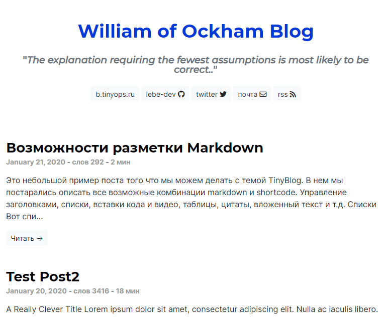

# TinyBlog тема для Zola
Простая тема блога для генератора статических сайтов [Zola](https://github.com/getzola/zola).

[Демо](https://b.tinyops.ru)



## Как установить

**1. Добавляем git модуль к вашему проекту**

В корне проекта создаем файл `.gitmodules` со следующим содержанием:

```
[submodule "themes/tinyblog"]
	path = themes/tinyblog
	url = git@github.com:lebe-dev/tinyblog-zola-theme.git
```

**2. Создаем под каталог для темы**

Для Windows:

```shell script
mkdir themes\tinyblog
```

Для Linux:

```shell script
mkdir -p themes/tinyblog
```

**3. Подгружаем тему**

```shell script
git submodule update --init --recursive
```

**4. Указываем тему в качестве основной**

```
theme = "tinyblog"
```

# Настройка

## Как указать тип favicon

В секции `extra` определить параметр `favicon_type`. Значение по умолчанию `image/x-icon`.

```toml
favicon_type = "image/x-icon"
```

## Как подтвердить владение сайтом в Яндекс.Вэбмастере

Добавляем в `config.xml` в секцию `[extra]` параметр `yandex_webmaster_verification_code`:

```toml
yandex_webmaster_verification_code = "КОД ПОДТВЕРЖДЕНИЯ"
```

## Как подключить Яндекс.Метрику

Добавляем в `config.xml` в секцию `[extra]` параметр `yandex_metrika_counter`:

```toml
yandex_metrika_counter = "НОМЕР-СЧЕТЧИКА"
```

## Как подключить Яндекс.Турбо

Подробнее про сервис - [https://yandex.ru/dev/turbo/](https://yandex.ru/dev/turbo/)
 
Добавляем в `config.xml` в секцию `[extra]` включаем параметр `yandex_turbo_pages`:
 
```toml
yandex_turbo_pages = true
```
